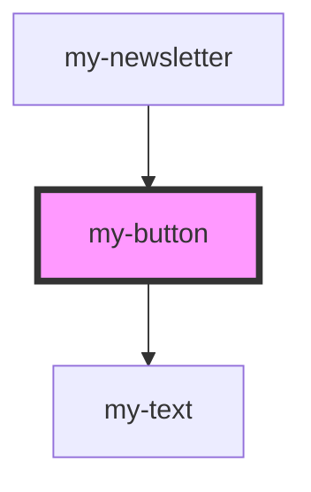

# my-button

<!-- Auto Generated Below -->

## Properties

| Property | Attribute | Description | Type                              | Default     |
| -------- | --------- | ----------- | --------------------------------- | ----------- |
| `as`     | `as`      |             | `string`                          | `'button'`  |
| `type`   | `type`    |             | `"button" \| "reset" \| "submit"` | `undefined` |

## Dependencies

### Used by

 - [my-newsletter](../newsletter)

### Depends on

- [my-text](../text)

### Graph

----------------------------------------------

*Built with [StencilJS](https://stenciljs.com/)*
