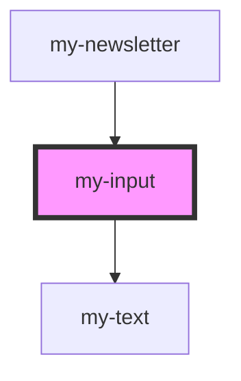

# my-input

<!-- Auto Generated Below -->

## Properties

| Property | Attribute | Description | Type                                                              | Default     |
| -------- | --------- | ----------- | ----------------------------------------------------------------- | ----------- |
| `label`  | `label`   |             | `string`                                                          | `undefined` |
| `type`   | `type`    |             | `"date" \| "number" \| "password" \| "search" \| "tel" \| "text"` | `'text'`    |
| `value`  | `value`   |             | `string`                                                          | `undefined` |

## Events

| Event         | Description | Type               |
| ------------- | ----------- | ------------------ |
| `changeEvent` |             | `CustomEvent<any>` |

## Dependencies

### Used by

 - [my-newsletter](../newsletter)

### Depends on

- [my-text](../text)

### Graph

----------------------------------------------

*Built with [StencilJS](https://stenciljs.com/)*
