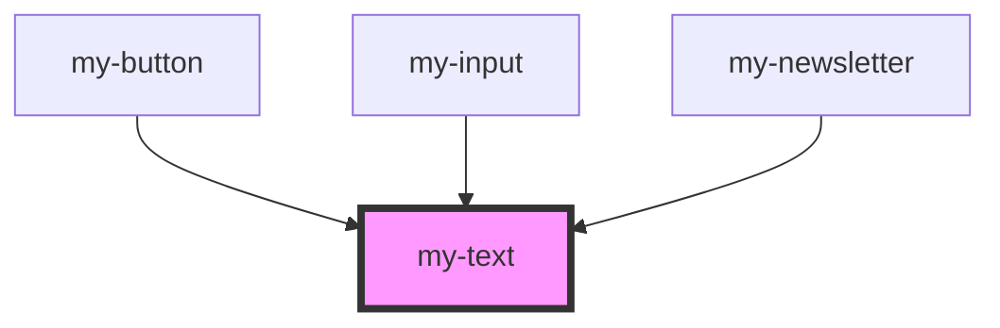

# my-component

<!-- Auto Generated Below -->

## Properties

| Property | Attribute | Description | Type                             | Default     |
| -------- | --------- | ----------- | -------------------------------- | ----------- |
| `as`     | `as`      |             | `string`                         | `'span'`    |
| `font`   | `font`    |             | `"base" \| "title"`              | `undefined` |
| `size`   | `size`    |             | `"large" \| "medium" \| "small"` | `undefined` |

## Dependencies

### Used by

 - [my-button](../button)
 - [my-input](../input)
 - [my-newsletter](../newsletter)

### Graph

----------------------------------------------

*Built with [StencilJS](https://stenciljs.com/)*
